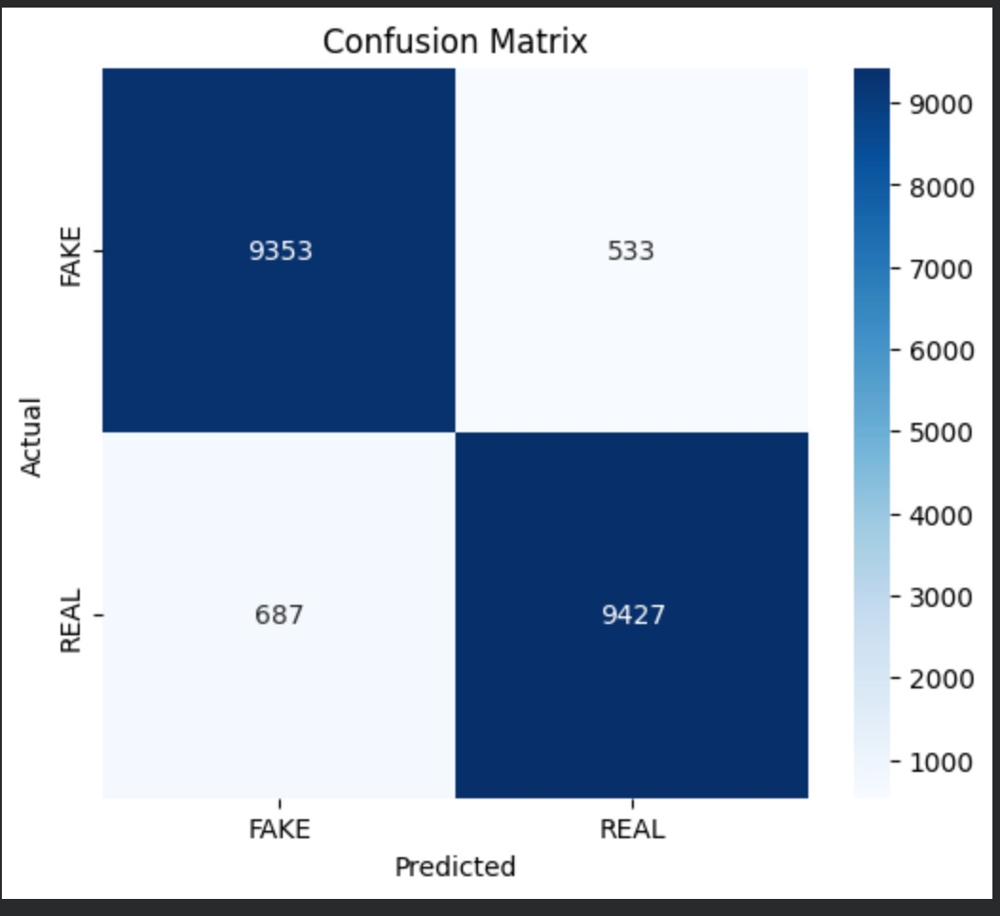
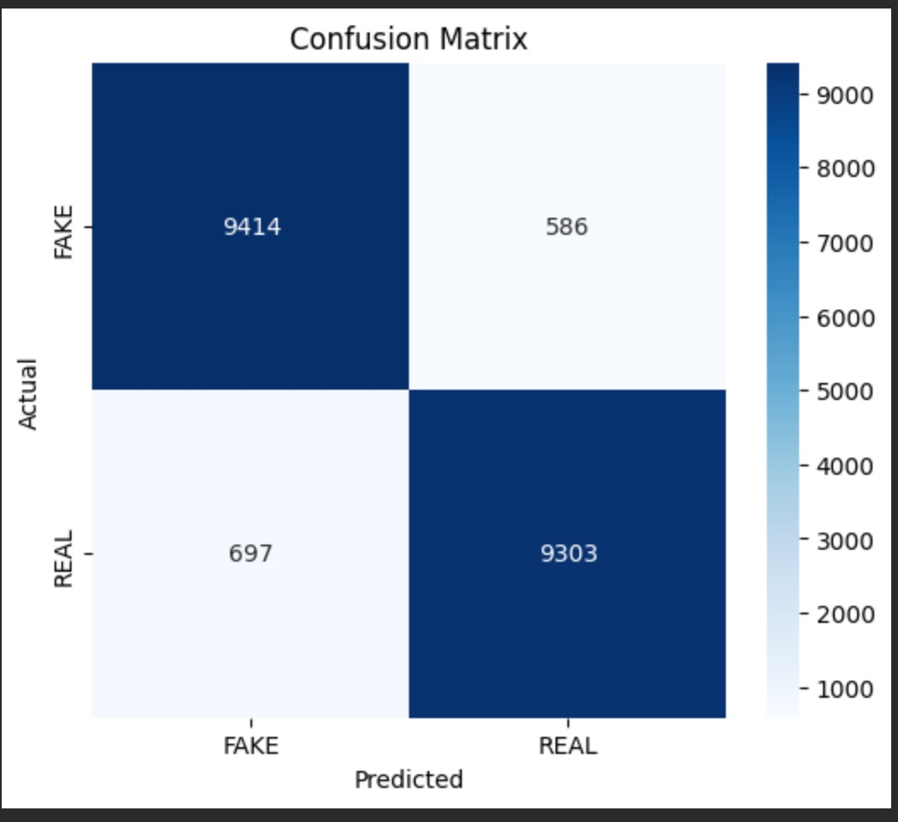

# Navigating-Synthetic-Reality
# Navigating Synthetic Reality: AI-Generated Image Detection

## 1. Executive Summary
This project focuses on the detection of AI-generated synthetic imagery using a deep learning approach. By leveraging a **ResNet-18** architecture trained on the **CIFAKE dataset**, the model identifies subtle artifacts in synthetic textures. Beyond simple classification, the project explores model transparency via **Grad-CAM** and evaluates resilience through a rigorous **Adversarial Robustness Benchmark**.

## 2. Model Architecture & Training
* **Base Model:** ResNet-18 (Pre-trained on ImageNet).
* **Customizations:** Modified the fully connected (`fc`) layer with a **Dropout (p=0.5)** layer followed by a **Linear(512, 2)** output to handle binary classification (Real vs. Fake).
* **Preprocessing:** Images were resized to $32 \times 32$ pixels and normalized using CIFAR-specific constants:
    * $\mu = [0.4914, 0.4822, 0.4465]$
    * $\sigma = [0.2023, 0.1994, 0.2010]$
* **Optimization:** Adam optimizer ($\eta = 0.0003$) with a StepLR scheduler and Early Stopping based on validation loss.

## 3. Performance Metrics
The model demonstrates high precision in controlled environments:
* **Test Accuracy:** 93.58%
* **High-Confidence Precision:** The model identified **8,445 true FAKE images** with a confidence score $> 0.9$, indicating strong feature extraction for synthetic artifacts.

| Metric | REAL Class | FAKE Class |
| :--- | :--- | :--- |
| **Precision** | 0.94 | 0.93 |
| **Recall** | 0.93 | 0.94 |
| **F1-Score** | 0.94 | 0.94 |

## 4. Adversarial Robustness Benchmark
To test the model's reliability against malicious manipulation, we conducted a benchmark using 1,000 high-confidence samples. The Attack Success Rate (ASR) measures how often the model was successfully fooled.

### Final Robustness Report
| Attack Method | ASR (%) | Robust Accuracy (%) | Avg $L_\infty$ |
| :--- | :--- | :--- | :--- |
| **Clean (Baseline)** | 0.00% | 97.60% | 0.0000 |
| **FGSM** | 40.57% | 59.60% | 2.3811 |
| **PGD** | 61.36% | 38.90% | 2.3811 |
| **DeepFool** | 74.54% | 25.10% | 2.3662 |
| **C&W** | 60.00% | 40.00% | - |

### Interpretation
* **High Vulnerability:** The model is most susceptible to **DeepFool (74.54% ASR)**, which finds the smallest perturbation to push an image across the decision boundary.
* **Iterative vs. Single-Step:** **PGD (61.36%)** significantly outperformed FGSM (40.57%), demonstrating that iterative noise injection is highly effective at bypassing the model’s learned features.
* **Distortion:** The $L_\infty$ metrics (averaging $\sim 2.38$) suggest that even relatively small, imperceptible changes in pixel values can lead to a total collapse of classification accuracy.

## 5. Explainability (Grad-CAM)
The Grad-CAM analysis targeted **Layer 2** and **Layer 3** of the ResNet-18.
* **Initial Observation:** Early heatmaps showed a concentration on image corners (background artifacts).
* **Current State:** Post-refinement, the model focuses on mid-level semantic features. This explainability layer confirms that while the model is accurate, it often relies on high-frequency noise typical of synthetic generators rather than just the "subject" of the image.

## 6. Deployment
The system is deployed via a **Streamlit Web Application**, allowing users to:
* Upload local images.
* Receive real-time classification (REAL/FAKE).
* View confidence metrics to gauge the model's certainty.

## 7. Final Interpretation & Conclusion

### Project Summary
The "Navigating Synthetic Reality" project successfully developed a high-performance detection system for AI-generated imagery. Achieving a **93.58% test accuracy** on the CIFAKE dataset, the ResNet-18 model proved highly capable of identifying the subtle, often imperceptible mathematical signatures left by generative models. By integrating Grad-CAM explainability, we moved beyond "black-box" AI to verify that the model focuses on meaningful structural and textural features.

### Critical Insights from Adversarial Testing
The most significant finding lies in the Adversarial Robustness Benchmark. While the model is near-perfect on clean data (97.6% confidence), the vulnerability to attacks highlights a crucial reality:
* **Perceptual Fragility:** Even small $L_\infty$ perturbations ($\sim 2.38$) can cause the model to flip its classification, suggesting that synthetic detectors must be hardened with adversarial training.
* **Confidence vs. Reliability:** The model can remain highly confident while being wrong, reinforcing the need for the human-in-the-loop interface provided by our Streamlit deployment.

### Future Roadmap
1.  **Adversarial Hardening:** Incorporate FGSM/PGD-augmented images into the training pipeline to decrease the Attack Success Rate.
2.  **Architecture Expansion:** Test Vision Transformers (ViTs) to capture more global context compared to the local receptive fields of ResNet.
3.  **Cross-Model Generalization:** Evaluate against newer architectures (Flux, Stable Diffusion XL) to ensure features translate to the latest generation of synthetic media.

### Final Verdict
This project demonstrates that while deep learning provides a powerful first line of defense against synthetic misinformation, it is not a silver bullet. A truly robust "Synthetic Reality" navigator requires the trifecta demonstrated here: **High-accuracy classification**, **Visual transparency (Explainability)**, and **Rigorous adversarial stress-testing**.
